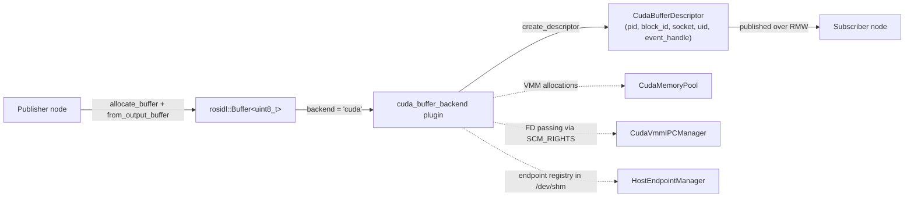
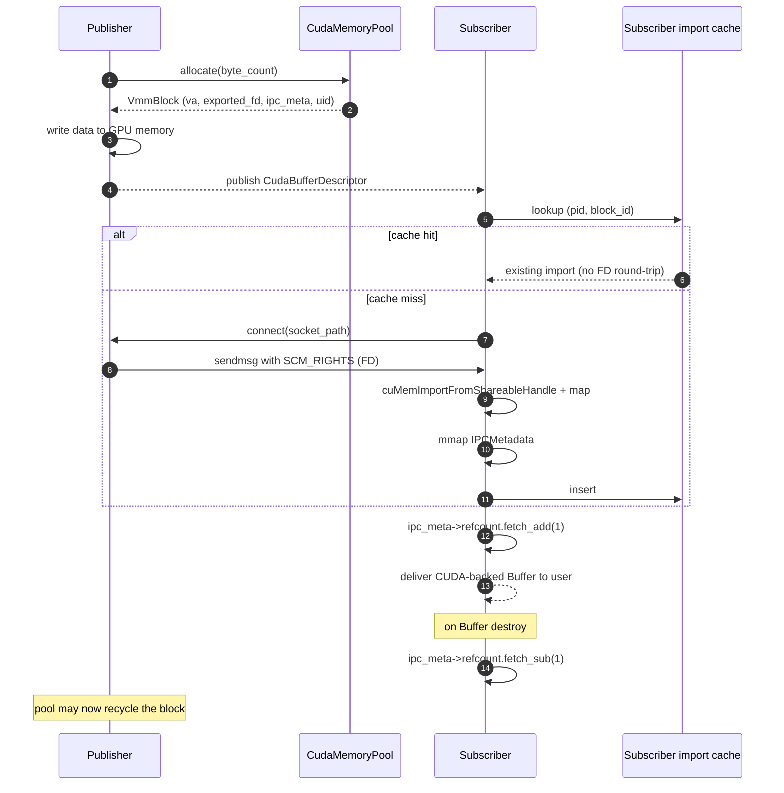
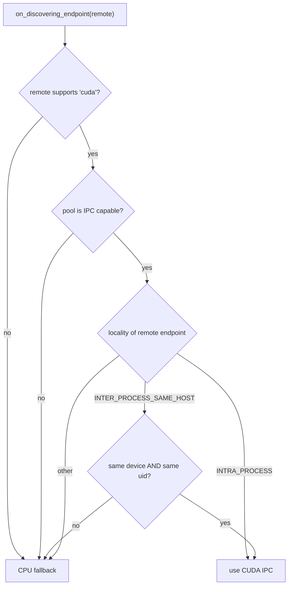
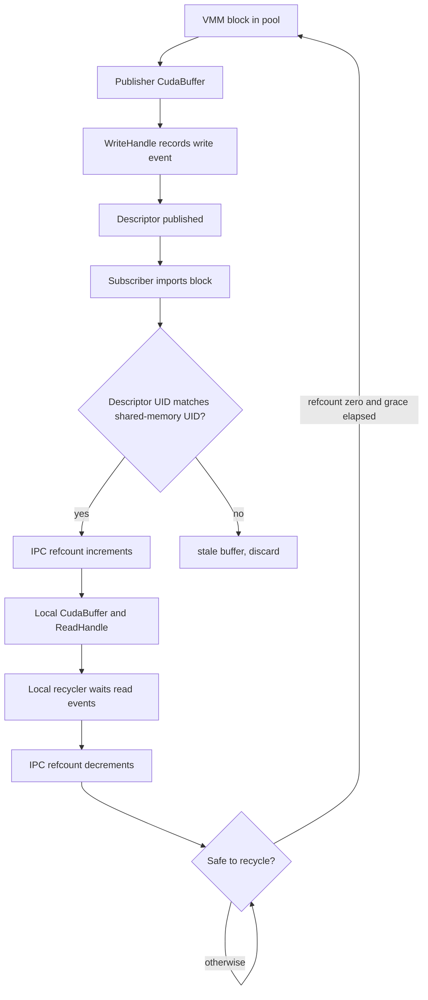

# Design

## Introduction

`cuda_buffer_backend` is a `rosidl::Buffer<T>` storage backend that allocates
the message payload in CUDA Virtual Memory (VMM) and delivers it to a
co-located subscriber **without serialization or host copies** when the
runtime conditions allow it. When they don't, the system falls back to the
default CPU path automatically.

The optimized path is taken when the publisher and subscriber are on the
**same host, same CUDA device, same Linux user**, and at least one of the
two endpoints is intra-process or inter-process-on-the-same-host.

## High-level architecture

Three runtime singletons make this work:

- `CudaMemoryPool` — VMM allocator with a free-list. Each block has a
  stable `(pid, block_id)` identity for its publisher's lifetime.
- `CudaVmmIPCManager` — per-process FD dispatcher. Listens on per-block
  Unix-domain sockets and serves the exported VMM FD via `SCM_RIGHTS` when
  a subscriber connects.
- `HostEndpointManager` — host-wide shared-memory registry of ROS 2
  endpoints (pid, gid, device, uid, intra-process flag). Used by the
  backend to decide IPC capability for any discovered remote endpoint.

## Publish / subscribe flow

The first transmission of a `(pid, block_id)` pair does the full FD
handshake; every subsequent transmission of the same pair is a cache hit.

## IPC capability decision

When a remote endpoint is discovered, the backend decides whether to use
the optimized path or fall back to CPU:

Locality comes from `HostEndpointManager`: every backend's
`on_creating_endpoint` publishes its (pid, gid, device, uid, intra-process
flag) into the host-wide shared registry, and `on_discovering_endpoint`
queries it for the remote gid.

## CUDA buffer lifetime

A CUDA buffer is a pooled VMM block wrapped in `CudaBuffer`. When the block is
imported in another process, the import increments the shared-memory IPC
refcount, while local `shared_ptr` ownership keeps the imported `CudaBuffer`
alive inside that process. When the last local owner is released, the recycler
waits for recorded CUDA read events before decrementing the IPC refcount.
The publisher may recycle the block only after the IPC refcount returns to
zero and a short grace window has elapsed. If a late subscriber still races
with reuse, it detects stale data on first access by comparing the descriptor
UID with the UID stored in shared memory.
